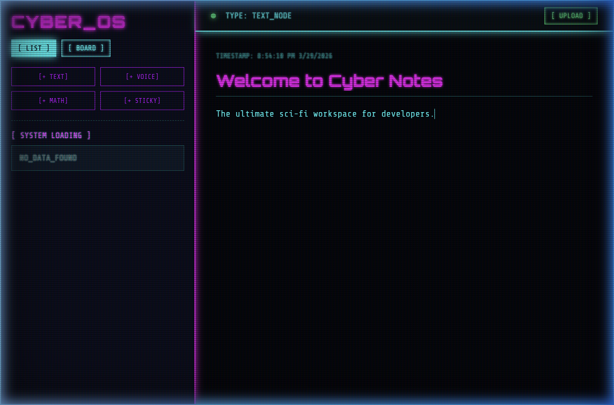
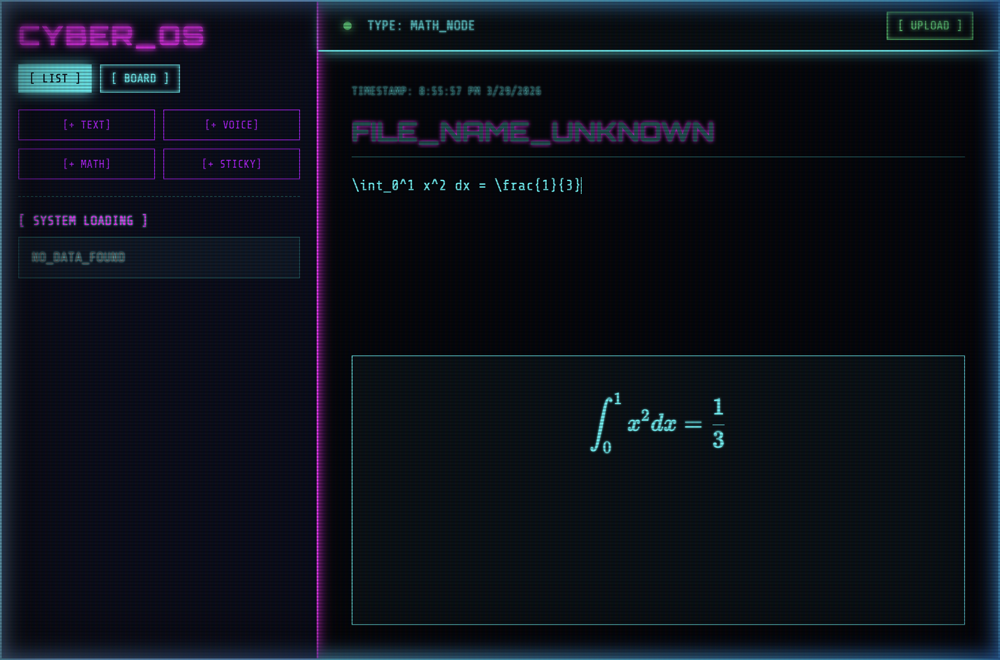
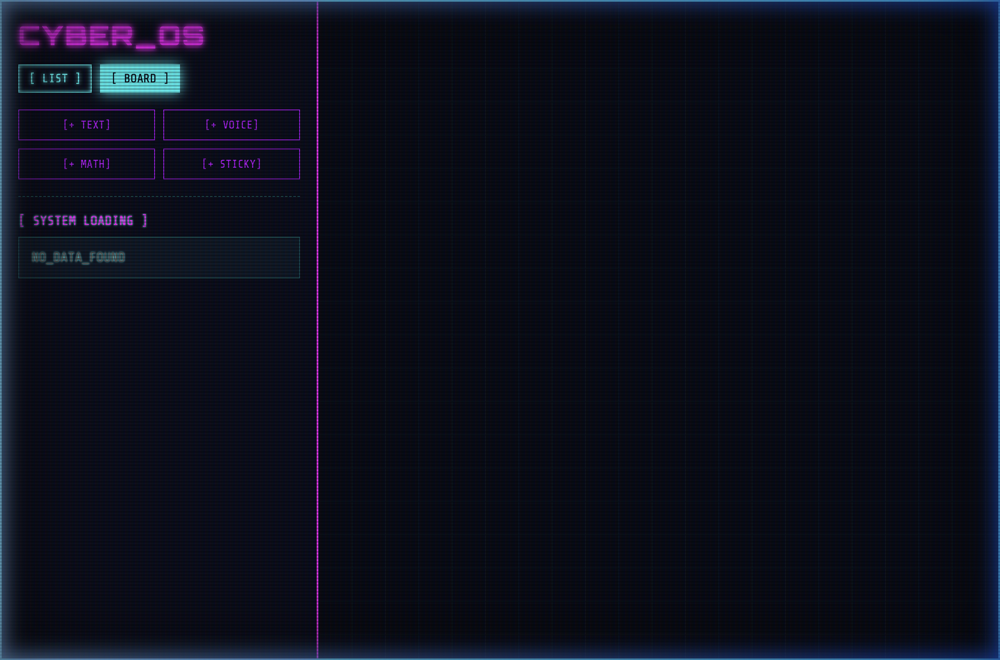

# 🖲️ Cyber Notes OS v1.0



Welcome to **Cyber Notes OS**, the ultimate Sci-Fi styled workspace designed for developers, mathematicians, and hackers. This is not just a standard to-do list — it is a **multi-modal terminal interface** built to handle complex mathematical rendering, native browser voice recordings, and an infinitely draggable 2D Matrix Grid for sticky note persistence.

<br />

## 🎥 Full Video Demonstration
Check out the full workflow and visual capabilities below:


<br />

## ✨ Core Features & Nodes

The ecosystem is split into distinct "Nodes", allowing the dynamic creation of different data types inside the same application. 

### 1. `[+ TEXT]` Nodes
Sleek, monospaced data entry featuring native CRT scanline overlay filters and immersive neon accents. 

### 2. `[+ MATH]` Nodes
Integrated with **KaTeX** for lightning-fast Mathematical Rendering. Need to calculate complex integrals or document formulas? Cyber Notes builds perfect mathematical UI equations dynamically as you type `LaTeX` input.


### 3. `[+ VOICE]` Nodes
Built natively on the **Web MediaRecorder API**, you can record your microphone directly inside the browser. The Node.js Backend features extended payload processing buffers to support real-time audio chunking, converting your voice directly into Base64 MongoDB saves.

### 4. `[ BOARD ]` Navigation & Sticky Nodes
Sometimes a list isn't enough. Toggle the **[ BOARD ]** Navigation view to swap the editor for a massive Matrix Grid Canvas. 
Deploy `[+ STICKY]` Notes and drag-and-drop them anywhere on the screen. The physics engine tracks the absolute X/Y mouse coordinates relative to the canvas and mathematically determines drop zones, seamlessly auto-syncing the state back to the database!


<br />

## 🛠️ Built With Modern Tech

- **Frontend Interface:** Vanilla ES6 JavaScript, Native DOM Drag-and-Drop algorithms, HTML5 MediaRecorder.
- **Styling UI/UX:** Heavily optimized custom CSS Variables, pseudo-element glow caching, and `backdrop-filter` glassmorphism techniques mapped alongside `Orbitron` fonts.
- **Backend Architecture:** Node.js, Express.js.
- **Database Tracking:** MongoDB Atlas, Mongoose ODM.
- **Microservices:** KaTeX implementation logic for formula parsing.

<br />

## 🚀 How to Run Locally

You can run your own version of Cyber OS on your local machine instantly.

1. **Clone the repository:**
   ```bash
   git clone https://github.com/ayuroy01/note-taking-app.git
   ```

2. **Navigate & Install:**
   ```bash
   cd note-taking-app/server
   npm install
   ```
   *(Ensure you have a `.env` file referencing your MongoDB URL and preferred PORT config!)*

3. **Start the Engine:**
   ```bash
   npm start
   ```

4. **Access the Interface:**
   Navigate your browser to `http://localhost:3000` to interact with your new workspace.
